# Docker
## 1. Docker是什么
Docker 是一个开源的应用容器引擎，让开发者可以打包他们的应用以及依赖包到一个可移植的容器中，然后发布到任何流行的 Linux 或 Windows 操作系统的机器上。   
形象比喻：公寓楼有许多房间，互补干扰，同时共享大楼基础设施(内核)，可以实现快速入住和搬出。   
## 2. 核心概念   
三个基础概念：镜像(Image)，容器(Container)，仓库(Repository)   
📁 镜像 (Image)   
一个只读的模板   
它包含了运行某个软件所需的所有代码、运行时、库、环境变量和配置文件，可以理解为菜谱，我们可以知道菜谱需要的材料(依赖)和制作过程。   

📦 容器 (Container)   
镜像的运行实例   
容器是从镜像创建的运行实例，它可以被启动、开始、停止、删除。每个容器都是相互隔离的。类似做好的菜。   

🗄️ 仓库 (Repository)   
集中定义存入镜像文件的地方，最有名的仓库是[Docker Hub](https://hub.docker.com/)     
集中存入菜谱，我们可以在仓库查找菜谱，制作许多一模一样的菜品。   

## 3. Docker核心优势   
|特性|传统虚拟机(VM)|Docker|
|------|--------|-------|
|启动速度|分钟级(需要加载整个OS)|秒级(只需要部分组件)|
|资源消耗|高(独占cpu和内存)|低(共享宿主机内核)|

## 4. Docker架构原理   
Docker使用客户端-服务器(C/S)架构    
Docker Client:用户交互的终端，发送命令   
Docker Host (Daemon)：后台守护进程，负责管理镜像、容器、网络和数据卷。   
Registry：存储镜像。   

## 5. windows安装Docker Desktop   
打开[Docker](https://www.docker.com/)安装对应版本即可。   
* 但是点击安装程序默认安装在C盘，如果不需要修改可以跳过这个步骤   
在下载目录下打开powershell，输入下面的命令   
Docker Desktop Installer.exe：安装程序的名称，可能不一样，按下载的名字修改   
--installation-dir：下载的目录，这里是F:\docker   
--wsl-default-data-root=F:\WSL\Docker-backend：拉取的镜像位置    

```powershell
 Start-Process 'Docker Desktop Installer.exe' '  install --installation-dir=F:\docker --backend=wsl-2 --wsl-default-data-root=F:\WSL\Docker-backend'
```

* 开启虚拟化   
```bash
systeminfo
```
    

如果没有则需要开启虚拟化(windows11)    
搜索*windows功能*，打开后找到*虚拟机平台 (Virtual Machine Platform)
Windows 虚拟机监控程序平台 (Windows Hypervisor Platform)* 直接勾选，如果有*Hyper-V*，也需要勾选。   
   

## 6. 桌面使用   
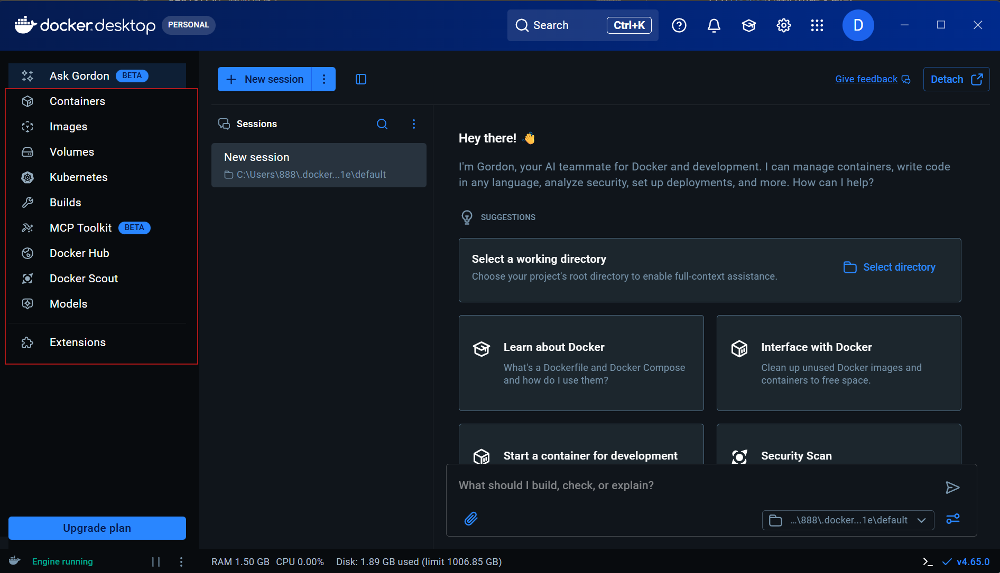   

* 左侧导航栏 (核心功能区)   

最常用的区域，包含了对 Docker 各种资源的管理：   

Ask Gordon - AI 助手

Containers (容器)：显示当前正在运行或已停止的所有容器。你可以在这里启动、停止、查看日志或直接进入容器终端。

Images (镜像)：列出你本地下载的所有镜像。可以查看镜像大小、标签，并进行清理或推送到云端。

Volumes (数据卷)：管理容器持久化数据的地方。如果你删除了容器但想保留数据，通常会使用 Volume。

Kubernetes：如果你开启了内置的 K8s 集群，可以在这里查看节点和工作负载状态。

Builds (构建)：查看镜像构建的历史记录和详细过程。

Docker Hub / Scout：用于连接远程仓库以及进行镜像的安全漏洞扫描。

Extensions (扩展)：Docker 的插件市场，可以安装如扫描工具、数据库管理工具等插件。

* 顶部工具栏

Search (Ctrl+K)：快速搜索本地的镜像、容器或文档。

Settings (齿轮图标)：配置 Docker 的资源分配（如 CPU、内存限制）、更新设置以及开启 K8s。

Notifications (铃铛)：查看系统更新或镜像扫描提醒。

Account (D 按钮)：登录你的 Docker ID 以访问私有仓库。

* 底部状态栏

Engine running (绿色)：表示 Docker 引擎正在正常运行。如果是橙色或红色，说明引擎正在启动或已崩溃。   

资源监控：实时显示当前 Docker 占用的 RAM (内存)、CPU 使用率以及磁盘剩余空间。   

版本号 (v4.65.0)：显示当前软件的版本。   

## 7. 命令操作   
### 7.1 基础信息查看   
查看客户端和服务端的信息   
```shell
docker version
```
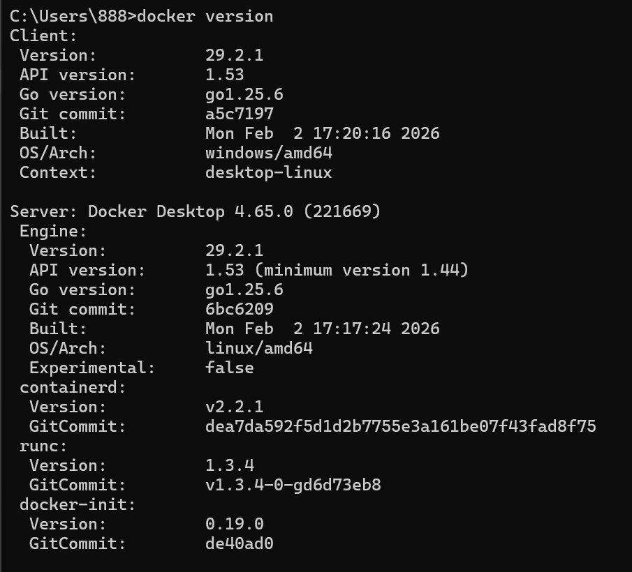   

查看Docker的系统信息
```shell
docker info
```

实时查看容器资源占用（CPU、内存、网络 I/O）   
```shell
docker stats
```

查看 Docker 占用的磁盘空间情况   
```shell
docker system df
```
### 7.2 镜像容器操作   
例如我们这里安装一个ubuntu系统的镜像   
* 搜索仓库的ubuntu镜像(查看其他的镜像修改名字即可,这里只是一部分,可以去仓库查看)   
```shell 
docker search ubuntu
```
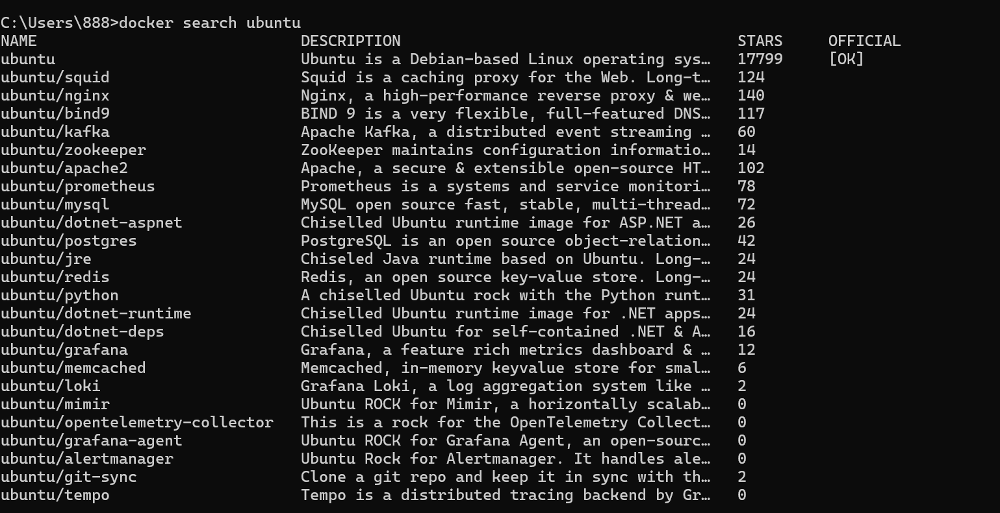   

* 拉取镜像   
```shell
docker pull ubuntu
```
或者    
:后面接标签版本号，默认是最新latest   
```shell
docker pull ubuntu:latest
```
另外我已经下载了latest版本，在仓库查找对应的版本    
```shell
docker pull ubuntu:rolling
```
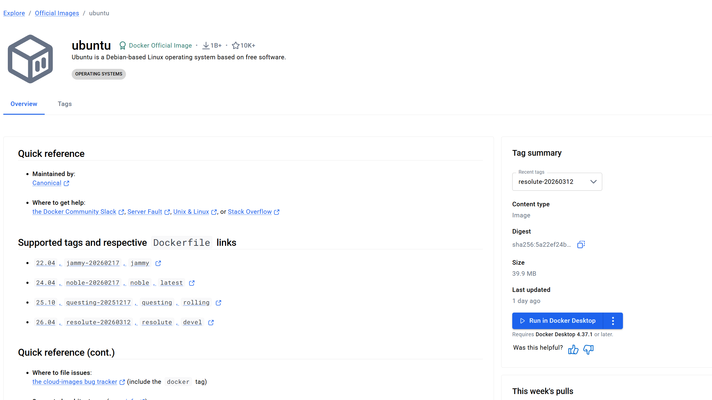  
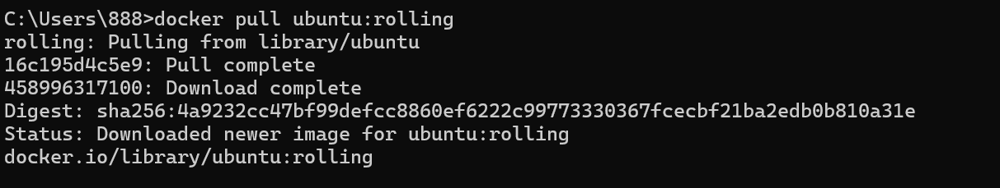    

* 查看镜像   
```shell
docker images
```
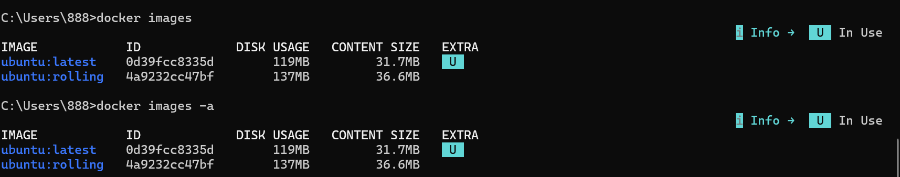   

* 创建容器   
-i: 交互模式   
-t: 分配终端   
--name: 容器命名   
/bin/bash: 启动 shell    
```shell
docker run -it --name test-ubuntu ubuntu:rolling /bin/bash
```
终端改变启动成功，基础的ubuntu占用非常小，常用的工具都没有安装，只包括最基础的命令        
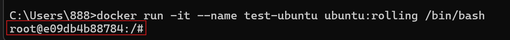   

退出终端   
```shell
exit
```

开启创建的实例   
两步：启动容器，连接容器    
```shell 
docker start test-ubuntu
docker exec -it test-ubuntu /bin/bash
```
或    
```shell 
docker start -ai test-ubuntu
```

查看运行的容器
```shell
docker ps
```
先运行容器，再查看    
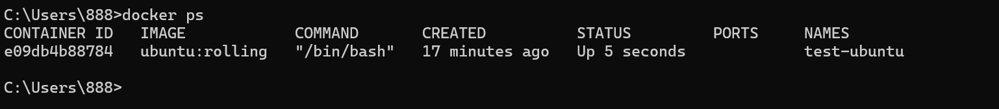   

* 删除容器镜像   
查看所有的容器
```shell
docker ps -a
```
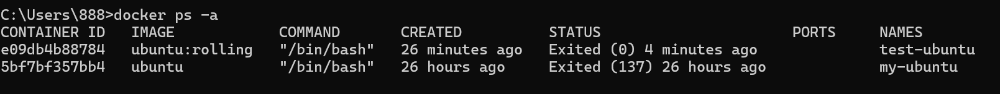
```shell
docker rm test-ubuntu
```
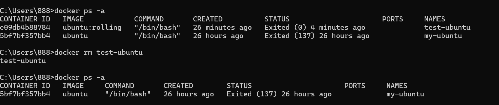   

删除镜像   
   
```shell
docker rmi ubuntu:rolling
```
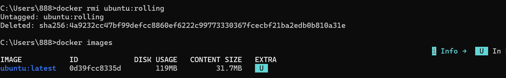   


## 8. 安装MySQL
### 8.1 优势   
不需要一个完整的操作系统就可以实现mysql操作   
### 8.2 拉取镜像   
```shell
docker pull mysql:8.4
```
### 8.3 创建连接容器   
|参数|全称|详细含义|
|---|---|---|
|-d|--detach|后台运行。让数据库像系统服务一样在后台跑，不会占用你当前的终端窗口。|
|--name my-mysql|--name|自定义容器名称。|
|-e MYSQL_ROOT_PASSWORD=1234|--env|设置环境变量。这是 MySQL 镜像强制要求的，用于初始化 root 用户的登录密码。|
|-p 3306:3306|--publish|端口映射。格式为 宿主机端口:容器端口。把容器内的 3306 端口映射到你电脑的 3306，这样 Navicat 等工具才能连上。注意这里本机如果有MySQL会占用3306端口，只要修改空闲的端口即可|
|mysql:8.4|image:tag|指定镜像版本。使用 8.4 版本的 MySQL 镜像启动。 |


```shell 
docker run -d --name my-mysql -e MYSQL_ROOT_PASSWORD=1234 -p 3306:3306 mysql:8.4
```
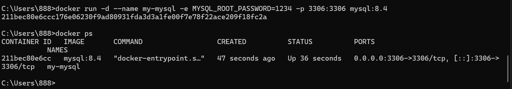    

连接   
作用是打开一个mysql终端   
```shell
docker exec -it my-mysql mysql -uroot -p
```
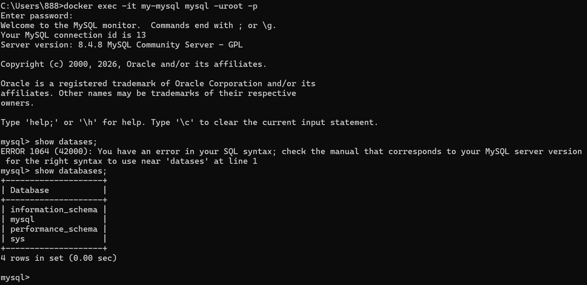   

### 8.4 远程连接    
这里以mysql官方提供的vscode插件连接   
这里已经映射到本地了，地址就是127.0.0.1或者localhost，端口是填写的映射端口   
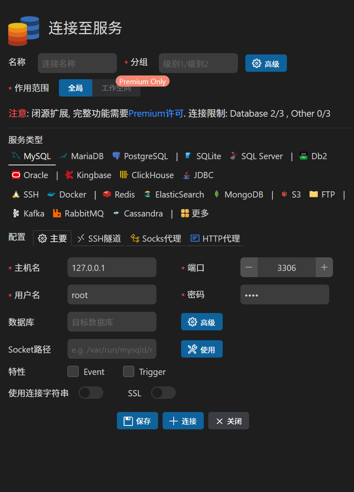   

## 8.5 具体实例    
### 8.5.1 建立数据库
```shell
docker exec -it my-mysql mysql -uroot -p
```
```SQL
create database STU_COURSE;
```
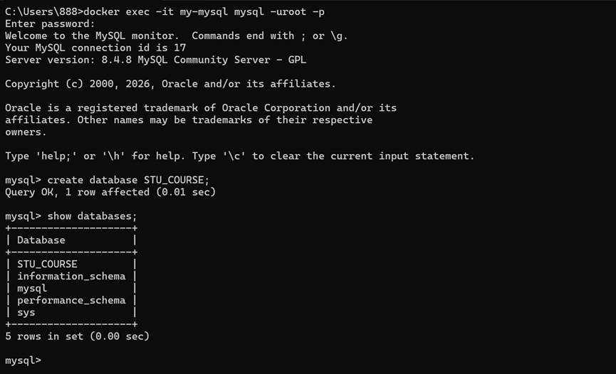

### 8.5.2 创建学生表、课程表、选课表
* 学生表
```SQL
create table student(
Sno char(8) primary key, Sname varchar(20) not null, Ssex CHAR(1), Sbirthdate date, Smajor varchar(20)
);
```
* 课程表
```SQL
create table course(
Cno char(5) primary key,Cname varchar(20) not null,Ccredit varchar(2),Cpno char(5),foreign key (Cpno) references course(Cno)
);
* 选课表
create table sc(
    Sno char(8),Cno char(5),Grade int(20) not null,Semester char(5),Teachingclass char(8),
    primary key(Sno,Cno),
    foreign key (Sno) references student(Sno),
    Foreign Key (Cno) references course(Cno)
    );
```
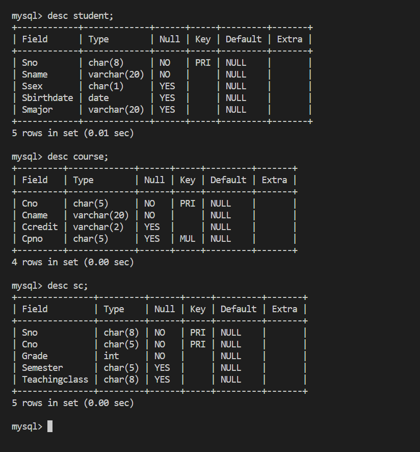   

### 8.5.3 修改表结构  
* 向student表增加一列“入学时间”， 列名S_entrance，数据类型为日期型。   
```SQL 
alter table student add column S_entrance date;
```
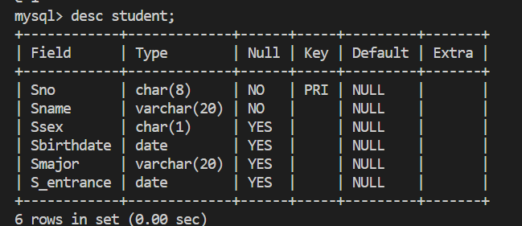   

* 删除“入学时间” S_entrance一列。   
```SQL
alter table student drop column S_entrance;
```
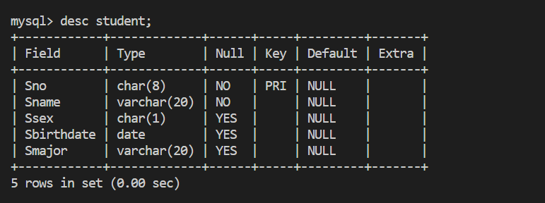   

* 将course表中Ccredit的数据类型改为int型。   
```SQL
alter table student modify Ccredit int;
```
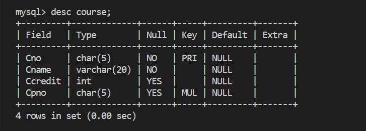   
* 在course表中增加课程名必须取唯一值的约束条件。   
```SQL
alter table course modify Cname varchar(20) unique;
```
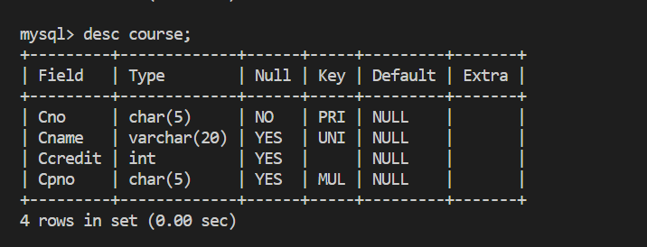   

* 删除sc表    
```SQL
drop table sc;
```
* 查看数据库的表
```SQL
show tables;
```
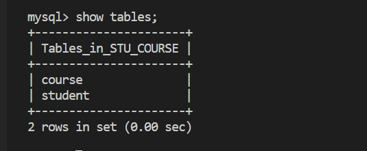

* 重新创建选课表   
```SQL
create table sc(
    Sno char(8),Cno char(5),Grade int(20) not null,Semester char(5),Teachingclass char(8),
    primary key(Sno,Cno),
    foreign key (Sno) references student(Sno),
    Foreign Key (Cno) references course(Cno)
    );
```
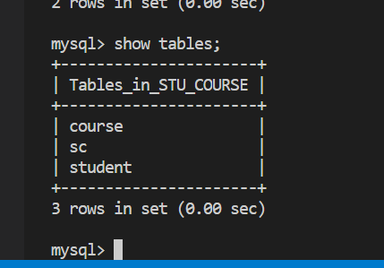


* 插入数据   
学生表   
```SQL
insert into student (Sno, Sname, Ssex, Sbirthdate, Smajor) values
('20180001', '李勇', '男', '2000-03-08', '信息安全'),
('20180002', '刘晨', '女', '1999-09-01', '计算机科学与技术'),
('20180003', '王敏', '女', '2001-08-01', '计算机科学与技术'),
('20180004', '张立', '男', '2000-01-08', '计算机科学与技术'),
('20180005', '陈新奇', '男', '2001-11-01', '信息管理与信息系统'),
('20180006', '赵明', '男', '2000-06-12', '数据科学与大数据技术'),
('20180007', '王佳佳', '女', '2001-12-07', '数据科学与大数据技术');
```

课程表    
```SQL
-- 首先插入没有先修课的课程，或者先将 Cpno 设为 NULL
insert into course value ('81001', '程序设计基础与C语言', 4, NULL),('81007', '离散数学', 4, NULL);

insert into course values 
('81002', '数据结构', 4, '81001'),
('81003', '数据库系统概论', 4, '81002'),
('81005', '操作系统', 4, '81001'),
('81006', 'Python语言', 3, '81002'),
('81004', '信息系统概论', 4, '81003'),
('81008', '大数据技术概论', 4, '81003');
```

选课表   
```SQL
insert into sc (Sno, Cno, Grade, Semester, Teachingclass) values
('20180001', '81001', 85, '20192', '81001-01'),
('20180001', '81002', 96, '20201', '81002-01'),
('20180001', '81003', 87, '20202', '81003-01'),
('20180002', '81001', 80, '20192', '81001-02'),
('20180002', '81002', 98, '20201', '81002-01'),
('20180002', '81003', 71, '20202', '81003-02'),
('20180003', '81001', 81, '20192', '81001-01'),
('20180003', '81002', 76, '20201', '81002-02'),
('20180004', '81001', 56, '20192', '81001-02'),
('20180004', '81002', 97, '20201', '81002-02'),
('20180005', '81003', 68, '20202', '81003-01');
```

### 8.5.4 索引操作   
* Student表按学号升序建唯一索引（索引名自定）。   
```SQL
create unique index student_sno_idx on student(Sno asc);
```
* Course表按课程号升序建普通索引（索引名自定）。 
```SQL  
create index course_cno_idx ON course(Cno asc);
```
* SC表按学号升序和课程号降序建唯一索引（索引名自定）。 
```SQL  
create unique index sc_sno_cno_idx on sc(Sno asc, Cno desc);
```
* 将Student表的索引名改为index_stu。   
```SQL
alter table student rename index student_sno_idx to index_stu;
```
* 将SC表上的索引删除   
```SQL
drop index sc_sno_cno_idx on sc;
```